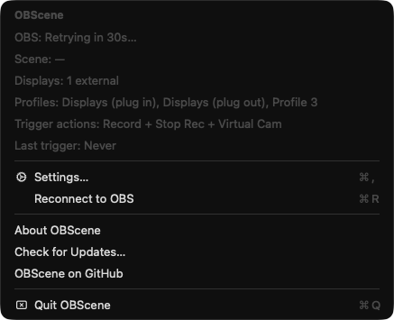
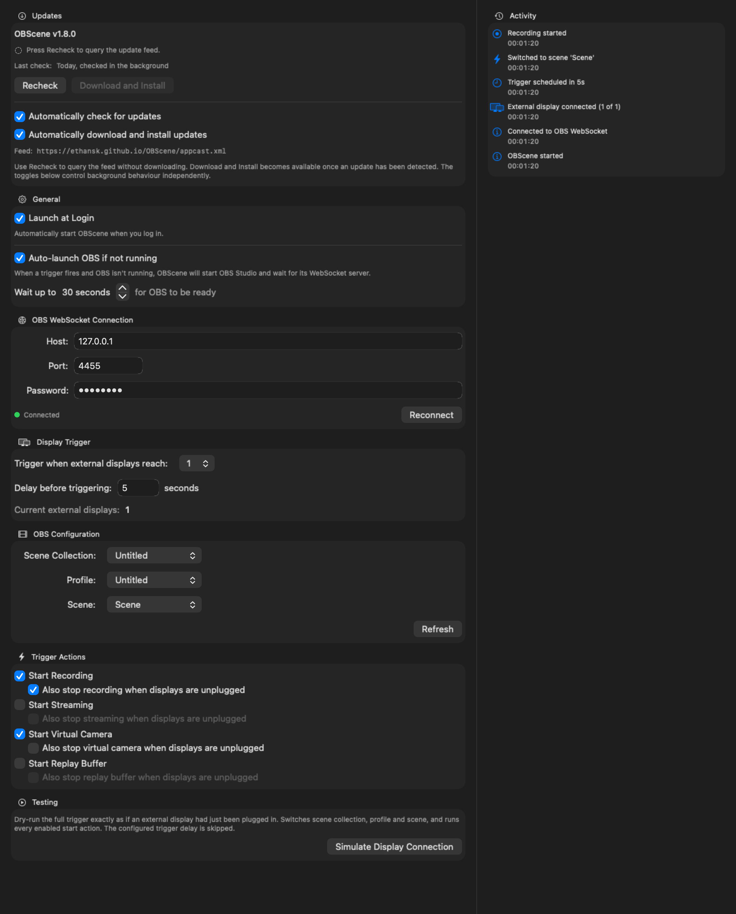

# OBScene

**OBS + Scene** — a tiny macOS menu bar app that drives OBS Studio when you plug in your external displays.

Dock into your battlestation and OBScene takes care of the boring bits: it switches your scene collection, profile, and active scene, then (optionally) starts recording, streaming, the virtual camera, or the replay buffer. Unplug and it can stop everything just as cleanly. All hands-free, all local.

**🌐 [ethansk.github.io/OBScene](https://ethansk.github.io/OBScene/)** — landing page with feature tour and screenshots.

<div align="center">
  
  &nbsp;
  
</div>


## Features

- **Automatic display detection** — uses CoreGraphics display-reconfiguration callbacks to react to monitors being plugged in or yanked out.
- **Configurable threshold** — decide how many external displays must be connected before OBScene fires (e.g. "when 1 external display is connected").
- **Scene / profile / scene collection switching** — pick exactly what OBS should switch to, or leave any of them untouched.
- **Four trigger actions** — independent toggles for **Recording**, **Streaming**, **Virtual Camera**, and **Replay Buffer**. Pick any combination.
- **Stop on unplug** — optionally stop any of the four actions the moment displays drop below the threshold. Perfect for "record while I'm docked, stop when I pack up."
- **Configurable delay** — a debounce window (default 5s) before the start actions fire, so OBS has time to settle after a display change.
- **OBS WebSocket v5** — talks to OBS via the built-in WebSocket server shipped with OBS 28+. No extra plugins.
- **Native macOS** — pure Swift + SwiftUI menu bar app. No dock icon, no Electron, no background tax.
- **Launch at Login** — one toggle, backed by `ServiceManagement`.
- **Persistent configuration** — everything saved locally via `UserDefaults`.
- **Automatic updates** — Sparkle 2.x checks for new releases on launch and every 24h. Downloads in the background, prompts you to install + relaunch. Use **Check for Updates…** in the menu-bar dropdown to check on demand. All updates are EdDSA-signed and delivered over the GitHub Pages [appcast feed](https://ethansk.github.io/OBScene/appcast.xml).

## Requirements

- macOS 13.0 (Ventura) or later
- OBS Studio 28+ (bundles obs-websocket v5)
- OBS WebSocket server enabled (Tools → WebSocket Server Settings)

## Installation

### Download a release

Grab the latest signed, notarised build from the [Releases page](https://github.com/EthanSK/OBScene/releases/latest):

- **DMG** (recommended): [OBScene-latest-mac-universal.dmg](https://github.com/EthanSK/OBScene/releases/latest/download/OBScene-latest-mac-universal.dmg) — open and drag OBScene.app into Applications.
- **ZIP**: [OBScene-latest-mac-universal.zip](https://github.com/EthanSK/OBScene/releases/latest/download/OBScene-latest-mac-universal.zip) — for scripted installs.

Both assets are **universal binaries** (Apple Silicon + Intel) built and published by [`.github/workflows/release.yml`](.github/workflows/release.yml) on every push to `main`. Once Developer ID secrets are configured the releases are signed with `Developer ID Application` and notarised by Apple; until then each release is ad-hoc signed and will prompt Gatekeeper on first launch. See [`docs/RELEASING.md`](docs/RELEASING.md) for release setup.

**After the first install, updates are automatic.** OBScene bundles Sparkle 2.x and checks https://ethansk.github.io/OBScene/appcast.xml on every launch plus every 24 hours, downloads new versions in the background, then prompts you to install + relaunch. Disable automatic checks from the "Check for Updates…" dialog if you'd rather update manually.

### Build from source

```bash
git clone https://github.com/EthanSK/OBScene.git
cd OBScene
open OBScene.xcodeproj
```

Then hit **Cmd+R** in Xcode. OBScene will appear in your menu bar.

Prefer the command line? You can build a universal `.app` bundle with one script:

```bash
./scripts/build-app.sh
open build/OBScene.app
```

Or compile the raw binary yourself:

```bash
mkdir -p build
swiftc -O -target arm64-apple-macos13 -parse-as-library \
    -o build/OBScene OBScene/*.swift
```

## Setup

1. **Enable OBS WebSocket**
   - Open OBS Studio.
   - Go to **Tools → WebSocket Server Settings**.
   - Check *Enable WebSocket server*.
   - Note the port (default `4455`) and set a password.

2. **Launch OBScene**
   - Run the app. A `display.2` icon will appear in your menu bar.

3. **Open Settings**
   - Click the menu bar icon and choose **Settings…**.

4. **Connect to OBS**
   - Fill in the WebSocket **Host**, **Port**, and **Password**.
   - Click **Connect**. The status dot goes green when the handshake succeeds.

5. **Pick your OBS targets** *(optional)*
   - Choose a **Scene Collection**, **Profile**, and **Scene** to switch to.
   - Leave any dropdown on *(Don't change)* to skip that step.

6. **Pick your trigger actions**
   - Toggle any combination of **Start Recording**, **Start Streaming**, **Start Virtual Camera**, and **Start Replay Buffer**.
   - Under each, toggle **Also stop … when displays are unplugged** to automatically tear down when you undock.

7. **Set the display threshold and delay**
   - Choose how many external displays should trigger OBScene.
   - Set the debounce delay (default 5 seconds) before start actions fire.

8. **Launch at Login** *(optional)*
   - Toggle it on so OBScene is always watching. You may need to approve it once in **System Settings → General → Login Items**.

Close the settings window and you're done. OBScene runs quietly in the menu bar and will do its thing the next time your displays change.

## How it works

```
External display change
          │
          ▼
Display count ≥ threshold?
          │
      ┌───┴───┐
     yes     no
      │       │
      ▼       ▼
  Wait N   Count crossed
  seconds  threshold going DOWN?
      │       │
      ▼       ▼
  Switch    Stop recording
  collection  (if enabled)
      │       │
      ▼       ▼
  Switch    Stop streaming
  profile     (if enabled)
      │
      ▼
  Switch scene
      │
      ▼
  Start recording /
  streaming /
  virtual cam /
  replay buffer
```

OBScene registers a `CGDisplayRegisterReconfigurationCallback` to receive real-time display events from macOS. On each event, it recounts external displays (excluding the built-in one) and compares against your configured threshold.

- **Going up** (count crosses threshold upward): schedules a delayed trigger. If displays are unplugged before the delay elapses, the pending trigger is cancelled.
- **Going down** (count crosses threshold downward): immediately fires the unplug trigger, which sends `StopRecord` / `StopStream` / `StopVirtualCam` / `StopReplayBuffer` to OBS for whichever stop-on-unplug options you enabled.

Commands reach OBS over the WebSocket v5 protocol, with SHA-256 challenge-response authentication if you've set a password.

### Auto-launching OBS

If OBS isn't running when a trigger fires, OBScene will launch it for you (this is enabled by default — turn it off in **Settings → General** if you'd rather manage OBS yourself). The launch happens in parallel with the trigger delay countdown, so on a 5s delay and a cold OBS start the total plug-in-to-recording time is usually close to the delay rather than delay + launch time.

- If OBS is installed but not running: OBScene launches it and polls the WebSocket port until it comes up, then fires the trigger actions.
- If OBS is already running but the WebSocket is disconnected: OBScene just reconnects (shorter timeout).
- If the WebSocket server is disabled inside OBS (**Tools → WebSocket Server Settings**): OBScene posts a notification telling you to enable it.
- If OBS Studio isn't installed: OBScene posts a notification pointing at [obsproject.com/download](https://obsproject.com/download).
- If you unplug the displays during the wait, the launch attempt is cancelled along with the pending trigger.
- Unplug-to-stop never auto-launches OBS — if OBS isn't running there's nothing to stop.

## Configuration reference

All settings are persisted locally in `UserDefaults` under the key `OBSceneConfig`.

| Setting | Description | Default |
| --- | --- | --- |
| **Launch at Login** | Start OBScene automatically on login via `SMAppService`. | off |
| **Auto-launch OBS if not running** | When a trigger fires and OBS isn't running, launch OBS Studio and wait for its WebSocket server before sending commands. | on |
| **Wait up to N seconds for OBS to be ready** | Timeout for the WebSocket handshake when auto-launching OBS. | `30` |
| **Host** | OBS WebSocket host. | `localhost` |
| **Port** | OBS WebSocket port. | `4455` |
| **Password** | OBS WebSocket password (optional). | *(empty)* |
| **Scene Collection** | Collection to switch to on trigger, or leave unchanged. | *(unchanged)* |
| **Profile** | Profile to switch to on trigger, or leave unchanged. | *(unchanged)* |
| **Scene** | Program scene to switch to on trigger, or leave unchanged. | *(unchanged)* |
| **External display threshold** | Number of external displays required to fire the trigger. | `1` |
| **Trigger delay** | Seconds to wait after the threshold is crossed before firing start actions. | `5` |
| **Start Recording** | Call `StartRecord` on trigger. | off |
| **Also stop recording when displays are unplugged** | Call `StopRecord` immediately when the display count drops below the threshold. | off |
| **Start Streaming** | Call `StartStream` on trigger. | off |
| **Also stop streaming when displays are unplugged** | Call `StopStream` immediately when the display count drops below the threshold. | off |
| **Start Virtual Camera** | Call `StartVirtualCam` on trigger. | off |
| **Also stop virtual camera when displays are unplugged** | Call `StopVirtualCam` immediately when the display count drops below the threshold. | off |
| **Start Replay Buffer** | Call `StartReplayBuffer` on trigger. | off |
| **Also stop replay buffer when displays are unplugged** | Call `StopReplayBuffer` immediately when the display count drops below the threshold. | off |

## Architecture

OBScene is intentionally small — ~6 Swift files, no third-party dependencies:

```
OBSceneApp.swift          App entry point (@main, NSApplicationDelegateAdaptor)
AppDelegate.swift         Menu bar item, settings window, notification wiring
ConfigStore.swift         UserDefaults-backed AppConfig with forward-compatible decoding
DisplayMonitor.swift      CoreGraphics display monitoring + trigger scheduling
OBSWebSocketManager.swift OBS WebSocket v5 client (auth, requests, responses)
SettingsView.swift        SwiftUI configuration UI
```

Key technology choices:

- **Swift + SwiftUI** for the UI, embedded in an `NSWindow` hosted by a classic `NSApplicationDelegate` so the app can live purely in the menu bar.
- **CoreGraphics** (`CGDisplayRegisterReconfigurationCallback`) for display change detection — the same API OBS and other pro tools rely on.
- **URLSessionWebSocketTask** for the OBS WebSocket client, with SHA-256 challenge-response auth implemented via `CommonCrypto`. No external WebSocket library.
- **ServiceManagement** (`SMAppService`) for Launch at Login, the modern approach that works with app translocation and user approval flows.

## Contributing

Issues and PRs welcome. OBScene is deliberately small — if you have a feature idea, open an issue first to discuss fit and scope.

Rough guidelines:

- Keep it native. No SPM dependencies unless there's a strong reason.
- Keep it small. The whole app should remain readable in an afternoon.
- Match the existing Swift style: clear comments when anything subtle is happening, `[weak self]` in long-lived closures, no force-unwraps in production paths.

## License

MIT License. See [LICENSE](LICENSE) for details.
